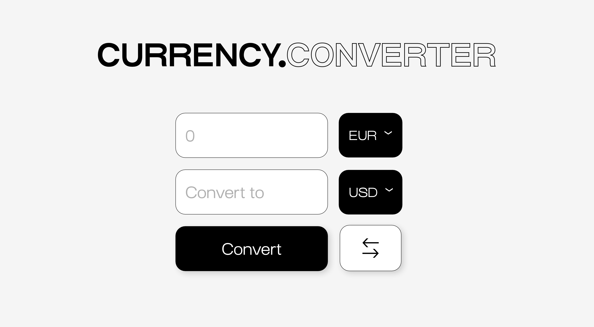

# 💸 CURRENCY CONVERTER

## 🔗 LIEN PROJET

- **Projet en ligne :** [http://currency-converter-evalambert.infinityfreeapp.com/](http://currency-converter-evalambert.infinityfreeapp.com/ "lien projet currency-converter en ligne")

## 📌 FICHE PROJET

- **Contexte :** Formation "Junior Developer" BeCode
- **Type :** Learning
- **Durée :** 1 jour
- **Équipe :** Solo

## 🎯 OBJECTIF

**🌱 Les incontournables**

Choisissez votre prochaine destination de voyage et vérifiez le taux de change : monnaie locale / Euros.

- Créez une petite page Web sur laquelle vous pourrez saisir le tarif local, elle vous indiquera le prix en euros.
- Vous devrez obtenir des tarifs mis à jour à partir d'API externes.
- Utilisez un formulaire qui se soumet à PHP, pas de JS autorisé / pas de PreventDefault.

**🌼 C'est bien d'avoir**

- Permettre à l'utilisateur de choisir entre différentes devises
- Fournissez un bouton pour basculer entre les types de valeur (donc Euro -> Dollar devient Dollar -> Euro)

## 🌐 TECHNO & LANGUAGES UTILISÉS

- Html
- Css
- Php

## ⏰ ÉTAT D'AVANCEMENT

- Responsivité : refaire en mobile-first
- Styliser et créer le btn "Reverse"
- Pofiner le style 🍎

## 👀 MAQUETTE DU PROJET

